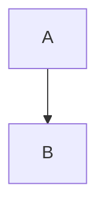
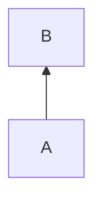
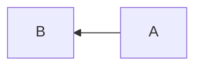
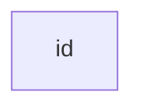
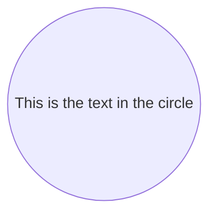
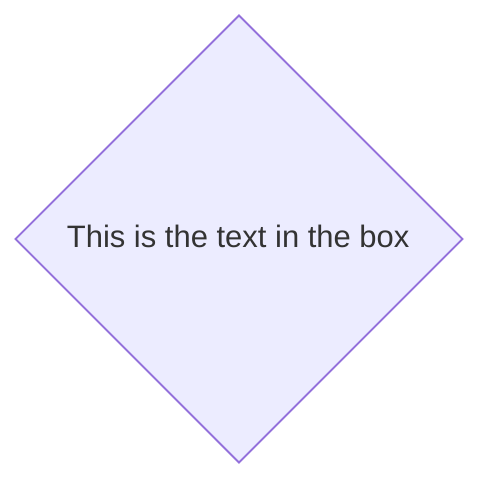

^427cfc

^25272e

^f50529

^54b967

^acc19e

 

^cb5aa8

 

^4c860c

^64970f

 

^880111

 

^7bd148

 

^8578e2

 

^d0b70c

 

^569c97

 

^eed5bf

 

^cb84da

 

^fda9dd

 

^988817

 

^b11644

 

^1343d8

 

^52aa7e
