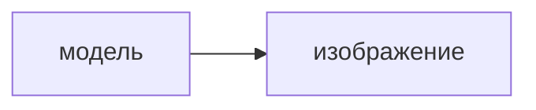
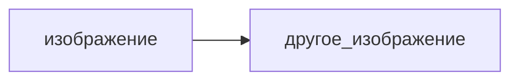
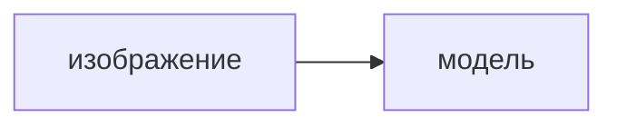

[[Предметы]]
## Вид сдачи
- Дифференцированный зачет
- Тесты в [[moodle]]

## Источники:
- Снижко, Флерова, Воронцов - Разработка компьютерной графики с использованием OpenGL
- Конспект лекций компьютерной геометрии и графики
- Компьютерная графика Блинова, Порев
- Шикин, Боресков изд. МИФИ

- [ ] _Блинова Т. А., Порев В. Н._ Компьютерная графика: [учебник для вузов] / ред. В. Н. Порев. - Киев: Юниор; СПб.: КОРОНА принт; Киев: ВЕК+, 2006. - 513 с. (67 экз.)
- [x] Снижко Е. А. Компьютерная геометрия и графика: конспект лекций -  БГТУ "ВОЕНМЕХ". - СПб., 2005. - 131 с. (453 экз., электронная версия)
- [x] Снижко Е. А., Флерова Н. В., Воронцов А. В. Программирование компьютерной графики с использованием библиотеки OpenGL: лабораторный практикум - БГТУ "ВОЕНМЕХ". - СПб., 2006. - 88 с. (4 экз., электронная версия)
- [ ] Шикин Е. В., Боресков А. В._ Компьютерная графика. Полигональные модели. - М.: ДИАЛОГ-МИФИ, 2005. - 461 с. (19 экз.)
- [ ] Снижко Е. А._ Использование 3D-моделирования для решения инженерных задач: лабораторный практикум [для вузов] - СПб., 2011. - 38 с (80 экз.).
- [ ] Снижко Е. А._ Использование 3D-моделирования для решения инженерных задач: лабораторный практикум [для вузов] - СПб., 2011. - 38 с (80 экз.).

## Работы:
- [x] ЛР1 - Подключение библиотек и т.д.
- [ ] ЛР2 - Примитивы OpenGL, осн. приемы построения двумерных объектов
- [ ] ЛР3 - Использование массивов вершин. Преобразование координат.
- [ ] ЛР4 - Трехмерные преобразования. Буфер глубины. Видовые параметры. Параллельная и перспективная проекции
- [ ] ЛР5 - Квадрик-объекты. Камера
- [ ] ЛР6 - Освещение
- [ ] ЛР7 - Текстуры: режимы фильтрации, режимы взаимодейтсивя текстуры с объектом, автоматическая генерация текстурных координат

#todo/systematize

Направления:
1. Визуализация

2. Обработка

3. Распознование  

Лекция 20.09.21

## Векторная графика
> Линия - элементарный объект изображения

> [[Изображение]] состоит из линий(отрезков прямых и кривых).

Каждая линия определятся набором параметров:
- Форма
- Начало
- Конец
- Толщина
- Цвет

> Векторная графика ориентирована на создание схем, логотипов, простых иллюстраций.

> Размер файла векторного изображения зависит от сложности изображения

Достоинства:
- Малый объем данных
- Легкость масштабирования  

Недостатки:
- Сложность создания фотореалистичных изображений
- Низкая скорость визуализации, необходимость растрирования при визуализации
- Сложные алгоритмы заливки контуров

Векторные форматы:
- AI - Adobe Illustrator
- CDR - Corel Draw
- DXF - AutoCAD 
- MIF-MID - ГИС
- WMF, EMF, PICT
Комбинированный формат
- PS, EPS
- PDF
- RIFF, AVI, MPEG

> Фрактальная графика - вычисляемая графика, изображение строится по формуле, системе формул, алгоритму.   
   Например - Множество Мандельбро

> Фракталы заключаются в последовательном применении некоторого алгоритма

Средства ФГ:
- Fractal design painter
- Fractal Design Expression
- Fractal design detailer
- Meta Creations Art Dabbler
- Xaos
- Fractal World

## Видеосистема ПК
### Внешние устройства
> Видеосистема ПК - монитор, видеопроцессор, видеопамять, внешние устройства графического ввода-вывода, драйвера.

Функции видеосистемы:
- Отображение символьной и графической информации на экране мониторов различных типов.
- Преобразование данных из цифровой формы в аналоговую(набор электрических сигналов) и наоборот.
- Поддержка работы монитора в растровом или векторном, алфавитно-цифровом или графическом, цветном или монохромным режимах.

Мониторы:
- Растровые и векторые
- CRT, LCD
- Стереомониторы

### CRT мониторы
> Изображение на основе электронно-лучевой трубрки(Cathode Rate Tube). Электрон пробегает по поверхности люминофора, засвечивая определенные точки экрана.

Составляющие:
- Соеденительные контакты
- База
- Фокусирующая система
- Электронная пушка
- Пластины вертикального отклонения
- Пластины горизонтального отклонения
- Экран с люминисцентным покрытием
- Электронный луч

> ЭЛТ по принципу формировани делятся на два основных класса:  
> c теневой маской  
> с аппетурной решеткой  
> гибридный - щелевой с маской
#фотография 

> Размер зерна CRT монитора значительно меньше чем у LCD монитора.

Использование:
- Промышленное оборудование
- Векторная графика
- Ряд профессиональных задач, связанных с точной цветопередачей.

### LCD(ЖК ) мониторы
> Построение изображения на основы матрицы жидких кристалов (Liquid Crystal Display)

Под воздействием поляризации свет поляризуется и проходит через определенную щель.
Три фильтра Red Green и Blue.
> Свет должен проходить через матрицу - свет появляется засчет подсветки.

Вопрос: можно ли считать 3D графику растровой.

$\frac{4}{3}$