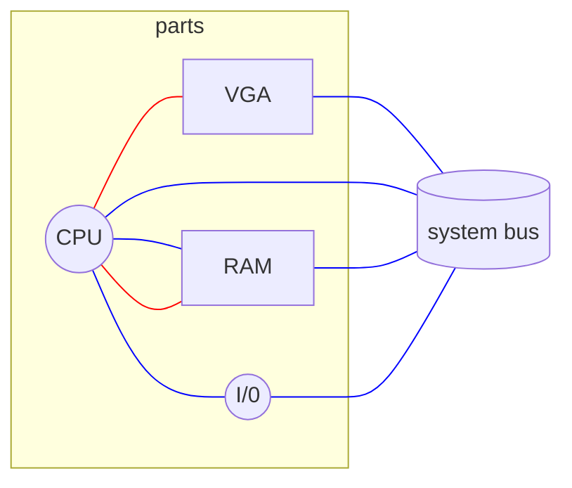
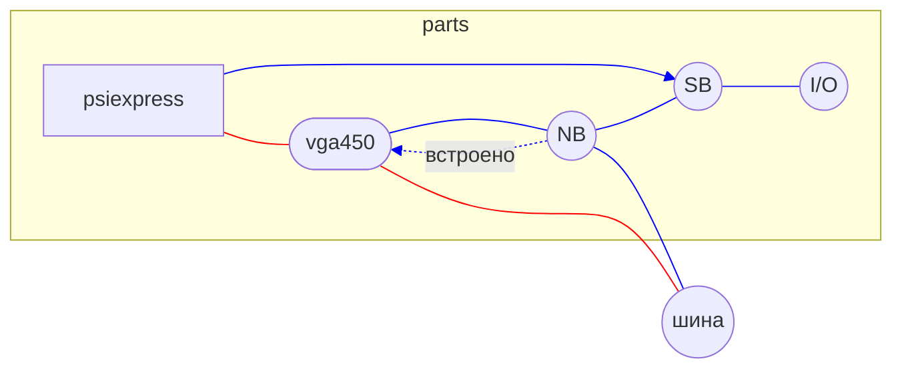
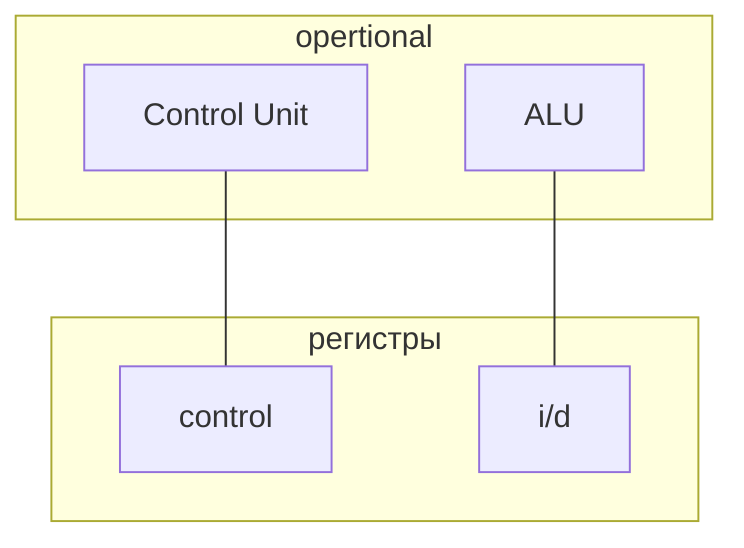
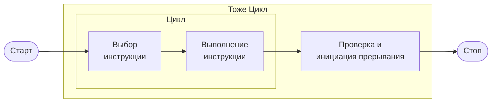

- [ ] ЛР1 - Работа в командной строке ОС Linux
- [ ] ЛР2 - Использование программы Midnight Commander
- [ ] ЛР3 - Текстовый редактор vi
- [ ] ЛР4 - Управление заданиями и процессами
- [ ] ЛР5 - Администрирование пользователя
- [ ] ЛР6 - Программирование на языке bash
- [ ] ЛР7 - Программирование на языке Си в ОС Linux

## Источники -
- Э. Татенбаум, Х. Бос - Современные ОСб 4-е издание, 2015
- Linus Torvalds - Just for fun

Лекция 17.09.21
---

---

### [[Регистры]]
(Чем ниже тем больше)
- L0 Catche 
	- процессорное
- L1 Catche
	- Данных
	- Инструкций
- L2 Catche
- L3 Catche
	- дополнительное
---

> [[Прерывание]] - прерывание нормального потока инструкций

> [[Приоритеты ]]- управляют задачами после прерывания

>Hyperthreading - быстрое переключение между двумя задачами

>Многопоточность предполагает предсказывание

64...128 ширина двухпоточной [[Системная шина|системной шины]]  
128...256 ширина [[Видеопамять|видеопамяти]]
