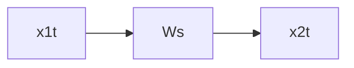

[16/09/21] лекция
Формы мат описания систем управления:
1. Структурно динамическая схема
2. Передаточные функции
3. Дифференциальные управления
4. Система дифференциальных уравнений

# Системы дифференциальных уравнений
[[Фазовое пространство]] - n мерное пространство, координатами в котором являются фазовые переменные системы. Размерность его - размерность системы, т.е. порядке системы диф уравнений в нормальной форме ([[Форма Коши|Форме коши]])
В общем случан имеет вид $\frac{dx_i(t)}{dt} = \sum^u_{i=1} a_ix_i$ ...
#дописать формулу

## [[Векторно-матричная форма модели системы]] 
используется для линейных систем систем, компактная форма записи системы диф уравнений
> X = AX + BU; Y = CX
где X =(x1,x2,..,xn) - вектор фазовых переменных
U = (u1,..,ur) - вектор входных сигналов
Y = (y1,..,yt) - вектор выходных сигналов
A - квадратная матрица, B - матрица входов, C - матрица выходов.

Первое уравнение назвают уравнение состояний, второе - уравнением выходов
 # Типовые динамические звенья
 Типовые динамические звенья:
 - Достаточно просты и удобны
 - Обладают набором основных динамических свойств, характерных для звеньев и систем управления
 
 Тип группы(с точки зрения общности свойств):
 1. Позиционные звенья
		1. Безынерционное звено
	 	2. Апериодическое звено 1-го порядка
			1. а RC - цепочка( #фотография )	
		 	2.б операционный усилитель( #фотография )
	  3. Апериодическое звено 2-го порядка ( #фотография )
	  4. Колебательное звено
	  5. Консервативное звено
1. Интегрирующие звенья
	1. Идеальное интегрирующее звено
2. Дифференцирующие звенья.
	1. Идеальное
	2. С замедлением
	
	
## Позиционные звенья
### 1. Безынерционное звено
Передаточная функция $$W(s) = k$$; Уравнение $$x_2 = kx_1$$
>Примеры: Делитель напряжения( #фотография), операционный усилитель, редуктор и потенциометрический датчик.

а) $x_1 = U_{вх}$, $x_2 = U_{вых}$;
$U_{вых} = \frac{R_1}{R_2}$ 

### 2. Апериодическое звено 1-го порядка
 Передаточная функция: $$W(s) = \frac{k}{Ts+1}$$ Уравнение $$T\frac{dx^2}{dt}+x2 = kx_1$$ #todo/fix #todo/add

### 3. Апериодическое звено 1-го порядка
 Передаточная функция W(s) = $\frac{k}{(T_1s+1)(T_2s+1)}$  Уравнение $T_1T_2\frac{d^2{x_2}}{dt^2}+T_2\frac{dx_2}{dt}+x_2 = kx1$ При условии: $T_2 \gt 2T_1$ 
 >Примеры: техническая реализация колебательного контура ( #фотография) #todo/add

### 4. Колебательное звено ( #фотография #todo/check)
 Передаточная функция W(s) = $$\frac{k}{(T_1s+1)(T_2s+1)}$$ ; Уравнение $$T_1T_2\frac{d^2{x_2}}{dt^2}+T_2\frac{dx_2}{dt}+x_2 = kx1$$ При условии: $$T_2 \gt 2T_1$$
 >Примеры: техническая реализация колебательного контура ( #фотография) #todo/add
 
 ### 5. Консервативное звено
 Передаточная функция W(s) = $$\frac{k}{(T^2s^2+1)}$$
 Уравнение $$T^2\frac{d^2{x_2}}{dt^2}+x_2 = kx1$$
 >Пример: идеальный колебательный контур

## Интегрирующие
### 1. Идеально интегрирующее
Передаточная функция: $$W(s) = \frac{k}{s}$$ 
Уравнение $$\frac{dx_2}{dt} = kx_1$$
>Примеры: RC цепочка с током... #todo/add 
### 2. Интегрирующее с замедлением
Передаточная функция: $$W(s) = \frac{k}{s(Ts+1)}$$
Уравнение: $$T\frac{d^2x_2}{dt^2}+\frac{dx_2}{dt} = kx_1$$
>Примеры: цепь на операционных усилителях #фотография 
### 3. Изодромное звено
Передаточная функция $$W(s) = \frac{k(\tau s+1)}{s}$$$$W(s) = k_1+ \frac{k_2}{s}$$
Уравнение $$\frac{dx_2}{dt} = k_1\frac{dx_1}{dt} + k_2x_1$$ 
## Дифференцирующие
### Идеально дифференцирующее
Передаточная функция $$W(s) = ks$$
Уравнение $$x_2 = k\frac{dx_1}{dt}$$
>Пример

#todo/add 
### Дифференциальное с замедлением
Передаточная функция $$W(s) = \frac{ks}{Ts+1}$$
Уравнение $$T\frac{dx_2}{dt}+x_2 = k\frac{dx_1}{dt}$$ 
>Пример: Различные четырехполюсники, тахогенератор с учетом сопротивления нагрузки
# Частотные характеристики...

[[Амплитудно-частотная характеристика]] - $А(\omega)$ - степень усиления или ослабления звеном амплитуды пропускаемого гармонического сигнала в зависимости от его частоты.
[[Фазо-частотная характеристика]] - $\phi(\omega)$ показывает зависимость от частоты фазового сдвига, вносимоо звеном в пропускаемый гармонический сигнал
... #todo/add #фотография 
[[Частотно-передаточная функция]] ЧПФ может быть представлена в **алгебраической** и **показательной** формах: #фотография 

[[Вещественная частотная характеристика]] - вещественная часть [[Частотно-передаточная функция|частотной передаточной функции]] 
#todo/add

## Лекция 23.09.21

Переменные характеристики:
- Переходная
	- Показывает, что апериодическое звено 1-го порядка воспроизводит входной сигнал
	- Но это происходит с замедлением - обладает свойством инерционности.
- Весовая

### Переходные характеристики
#фотография  
Выводы:
- Пропорциональность выходного сигнала входному, обеспечиваемая по окончании переходного процесса. Это свойство является единствнным для идеального звена - безынерционного
- Наличие переходного процесса. Различия между группой определяются количеством  соотношением постоянных времени, т.е характером инерционности.
Процесс в звеньях 2-го порядка(3), колебательном(4) и консервативном(5)

#фотография 
Интегрирующие
Выводы:
1. Общее свойство звеньев - в процессе выходной сигнал пропорционален интегралу входного
2. У остальных звеньев группы проявляются также:
	- Инерционность у звена с замедлением
	- Противоположенное изодромного   Так как постоянная времени:  в числителе в изодромном  в знаменателе в инерционном
	
Дифференцирующие:
Выводы:
1. Выходной сигнал пропорционален производной входного
2. Инертность с дифференцирующего звена с замедлением приводит к переходному процессу.
#todo/systematize 

### Частотные характеристики динамических звеньев и систем
$$x_1(t) \rightarrow W(s) \rightarrow x_2(t)$$

#todo 
- [ ] Записать определения характеристик

АЧХ - модуль ЧПФ: $$A(\omega) = |W(jw)|$$ 
ФЧХ - аргумент ЧПФ $$\phi...$$
#todo/add 

Вещественная частотная характеристика - вещественная часть частотной передаточной функции:
$$U(\omega) = ReW(j\omega)$$
Мнимая частотная характеристика - мнимая часть частотной передаточной функции:

Передаточная функция дожна быть представлена в форме дроби вида
$$W(s) = \frac{z_1*z_2}{z_3*z_4}$$ 
$z_i$ - комплексные функции $\omega$ 
Теперь выражения для АЧХ и ФЧХ можно получить на основе правил умножения и деления комплексных чисел.
$$A(\omega) = |W(j\omega)| = $$
#фотография 
1. k - масштабирует
2. jw - поворачивает против часовой на $\frac{\pi}{2}$
3. 1+jwT - поворачивает на $Arctg\omega T$ По модулю $\sqrt{1+\omega^2T^2}$
4. 1-jwT - поворачивает на $-Arctg\omega T$

#фотография
#фотография 

Требования к приближенному построению АФХ:
1. от нуля до бесконечности
2. 
