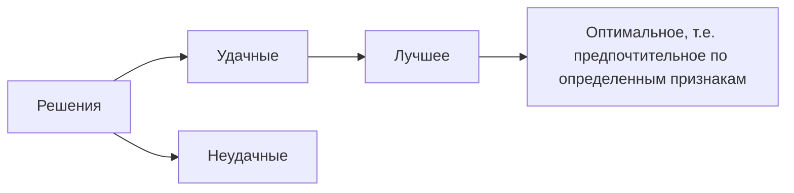

> Совокупность математических методов обоснования решений

> [[Операция]] - совокупность мероприятий направленных на достижение цели

Признаки:

- Адекватность
- Точность
- Приближенность

> ... - лицо принимающее решение #todo/fix

> [[Элементы решения]] - параметры совокупность которых образует решение

> [[Условия ограничения ]]- заданные фиксированные условия

> Множество решений  - 
>
> $$
> x \subset X
> $$
>
>  $x$ - решения из $X$ которые являются предпочтительными с той или иной точки зрения.

Оценки эффективности:
----------------------------------------

- Однокритериальные
- Многокритериальные

---

- Детерменированные
- Стохастические
- В условиях неопределенности

---

- Непрерывные
- Дискретные

Test of commiting changes

And another one

